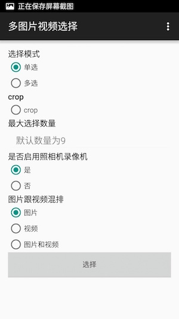

# MultiMediaSelector
仿微信图片&视频选择

注:基于 https://github.com/lovetuzitong/MultiImageSelector.git & https://github.com/tungdx/android-media-picker.git 展开.

[English Doc](README_EN.md)

### 功能
- 添加视频选择&视频录制
- 添加视频&图片预览
- 添加图片裁剪支持
- 添加视频压缩库videoCompress

### 截图
     
--------------------------------------------------------------------------------------------------------

```java

 compile project(':multi-media-selector')(recommend)
 
 dependencies {
    compile 'com.yovenny:multi-media-selector:1.0.0'
 }
 
```

* 第1步

``` java
   MediaOptions.Builder builder = new MediaOptions.Builder();
   MediaOptions options = null;
   builder.setShowCamera(showCamera).setMaxcount(maxNum);
   builder.setCropped(true);
   builder.setMode(MultiMediaSelectorFragment.MODE_SINGLE);
   builder.setMediaType(MultiMediaSelectorFragment.LIST_IMAGE_VIDEO);
   builder.setMediaListSelected(mSelectPath);
   options =builder.build();
   MultiMediaSelectorActivity.open(this, REQUEST_IMAGE, options);
```

* 第2步
在你的 `onActivityResult` 方法中接受结果. 例如:

```java
@Override
protected void onActivityResult(int requestCode, int resultCode, Intent data) {
    super.onActivityResult(requestCode, resultCode, data);
    if(requestCode == REQUEST_IMAGE){
        if(resultCode == RESULT_OK){
            // 获取返回的图片列表
            List<String> path = data.getStringArrayListExtra(MultiImageSelectorActivity.EXTRA_RESULT);
            // 处理你自己的逻辑 ....
        }
    }
}
```
-----------------

###更新日志

* 2016-6-7 by yovenny
  
   2. 添加录像并返回。
   3. 添加图片跟视频预览
   4. 添加视频压缩。
   5. 添加截图支持.
   - 原库可能的设计缺陷:点击`所有图片`会重新拉取数据,但点击`other folder`用的还是以前的数据.
    (更改保持了原有设计:mResultFolder 中videoAll,imageAll也只是第一次load的使用,二次便没有使用).
    (TODO)如需改进:改变数据的组装(`loadVideo->del video type ->pack`)
    
* fork after    
-------------------


### 感谢

* [square-picasso](https://github.com/square/picasso) A powerful image downloading and caching library for Android 
* [photoView](https://github.com/bm-x/PhotoView.git) support rotate
* [materialish-progress](https://github.com/pnikosis/materialish-progress.git) a materialish progress
* [videoCopress](https://github.com/yovenny/VideoCompress.git) videoCopress from telegram
* [cropper](https://github.com/edmodo/cropper.git) Android widget for cropping and rotating an image

