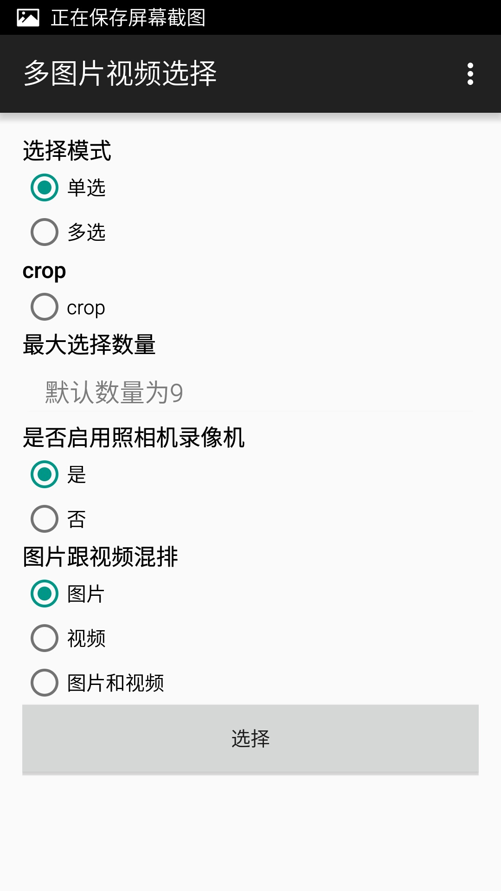
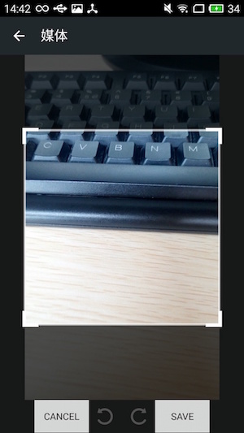

# MultiMediaSelector
like wechat photo&video selector
base in https://github.com/lovetuzitong/MultiImageSelector.git & https://github.com/tungdx/android-media-picker.git

[English Doc](README.md)

### Features
- add video list&record video support
- add video&photo preview support
- add photo crop

### ScreenShot
    
---------------------------------------------------------------------------------------------------------------------------------------

```java

 compile project(':multi-media-selector')(recommend)
 
 dependencies {
    compile 'com.yovenny.MultiMediaSelector:1.0.0'
 }
 
```

*Step 1 

``` java
   MediaOptions.Builder builder = new MediaOptions.Builder();
   MediaOptions options = null;
   builder.setShowCamera(showCamera).setMaxcount(maxNum);
   builder.setCropped(true);
   builder.setMode(MultiMediaSelectorFragment.MODE_SINGLE);
   builder.setMediaType(MultiMediaSelectorFragment.LIST_IMAGE_VIDEO);
   builder.setMediaListSelected(mSelectPath);
   options =builder.build();
   MultiMediaSelectorActivity.open(this, REQUEST_IMAGE, options);
```

* Step 2
Receive result in your `onActivityResult` Method. eg.

```java
@Override
protected void onActivityResult(int requestCode, int resultCode, Intent data) {
    super.onActivityResult(requestCode, resultCode, data);
    if(requestCode == REQUEST_IMAGE){
        if(resultCode == RESULT_OK){
            // Get the result list of select image paths
            List<String> path = data.getStringArrayListExtra(MultiImageSelectorActivity.EXTRA_RESULT);
           // do your logic ....
        }
    }
}
```
-----------------

### Change log

* 2016-6-7 by yovenny
   1. take video and return
   2. video preview suport
   3. videoCopress support
   4. photo crop support
  
    
* fork after    
-------------------


### Thanks

* [square-picasso](https://github.com/square/picasso) A powerful image downloading and caching library for Android 
* [photoView](https://github.com/bm-x/PhotoView.git) support rotate
* [materialish-progress](https://github.com/pnikosis/materialish-progress.git) a materialish progress
* [videoCopress](https://github.com/yovenny/VideoCompress.git) videoCopress from telegram
* [cropper](https://github.com/edmodo/cropper.git) Android widget for cropping and rotating an image

